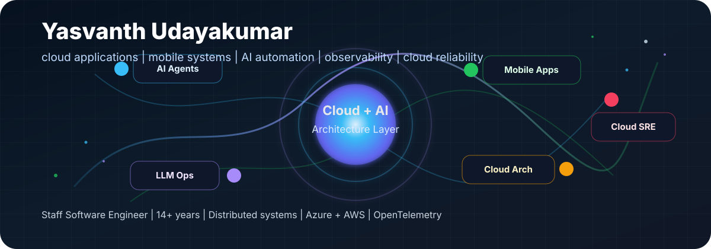
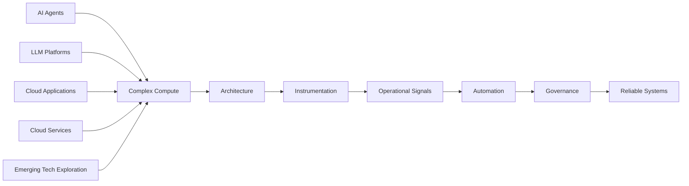

  

<h1 align="center">Yasvanth Udayakumar</h1>

  <strong>Staff Software Engineer building reliable cloud applications, mobile-connected systems, AI-agent workflows, and cloud-native operations.</strong>

  
  
  
  
  
  

---

## Signal

I work where software becomes operationally difficult: distributed systems, cloud applications, mobile-connected products, cloud-native platforms, observability, AI-agent workflows, LLM infrastructure, and secure architecture. I also explore emerging compute areas, including quantum and post-quantum readiness, from a learning and architecture perspective.

The pattern across my work is simple: make complex compute systems understandable, observable, and governable before they turn into production mysteries.

| I build | The engineering signal |
| --- | --- |
| AI-agent infrastructure | Codex, Copilot, Claude, OpenAI, MCP-style tool surfaces, structured workflows, review loops |
| LLM operations | Usage, cost, latency, reliability, provider governance, privacy-first telemetry |
| Cloud and mobile applications | APIs, backend services, mobile-connected workflows, dashboards, secure integrations |
| Cloud architecture | Multi-tenant SaaS, API gateways, event-driven services, automation, reliability, cost controls |
| Emerging technology exploration | High-level learning across quantum concepts, post-quantum readiness, AI-native systems, and future-facing architecture patterns |
| Cloud reliability | SLOs, incident response, traces, metrics, logs, dashboards, orchestration, automation |

## Bio

Yasvanth Udayakumar is a Staff Software Engineer with 14+ years of experience building reliable distributed systems, cloud applications, mobile-connected product platforms, observability infrastructure, AI-agent workflows, and secure cloud architecture across enterprise domains.

Short bio:

> Staff Software Engineer building cloud application architecture, AI-agent workflows, observability, and production reliability systems.

## Public-Safe Portfolio Map

This profile uses metadata only: technology choices, architecture patterns, industry categories, and engineering themes. It intentionally does not disclose private product ideas, customer-sensitive workflows, credentials, personal data, or confidential employer material.

| Dimension | Public-safe signals |
| --- | --- |
| Industries | Healthcare, automotive telemetry, retail, supply chain, IoT, enterprise SaaS, operational platforms, climate, geospatial, real estate, ecommerce, productivity, social safety, developer tooling |
| Product surfaces | Web apps, mobile apps, desktop apps, APIs, dashboards, CLIs, extensions, agent-tool interfaces |
| Architecture | Multi-tenant SaaS, API gateways, service templates, worker services, event-driven processing, workflow orchestration |
| Runtime | Docker, Kubernetes, Terraform, GitHub Actions, Azure DevOps, GitOps-style delivery |
| Observability | OpenTelemetry, Prometheus, Grafana, Datadog, CloudWatch, structured logs, semantic conventions |

## Operating Model

## Focus Areas and Exploration

**AI agents and LLM infrastructure**

- Agent-oriented workflows using Codex, GitHub Copilot, Claude, OpenAI, Continue, Cursor-style agents, and Model Context Protocol patterns
- Multi-provider AI integration across OpenAI, Anthropic Claude, AWS Bedrock, Google Vertex AI / Gemini, and local model runtimes
- Structured-output, prompt-governance, cost-control, privacy-first telemetry, and human-review patterns for production AI systems

**Cloud applications, mobile applications, and cloud architecture**

- Cloud application patterns for APIs, backend services, dashboards, worker services, and integrations
- Mobile-connected product workflows where apps, APIs, identity, notifications, data sync, and observability need to work together
- Cloud architecture across multi-tenant SaaS, event-driven systems, platform automation, deployment safety, reliability, and cost-aware operations

**Quantum and post-quantum exploration**

- High-level exploration of quantum software concepts and ecosystem tools such as Qiskit, Qiskit Aer, PennyLane, OpenQASM, IBM Quantum, AWS Braket, and Azure Quantum
- Learning-oriented exploration of how observability concepts could model quantum experiments, traces, metrics, and dashboards
- Interest in post-quantum readiness patterns such as NIST PQC, crypto inventory, crypto agility, SBOM, TLS, KMS, and governance workflows

**Reliability and observability**

- SLO design, alert quality, incident triage, RCA, post-incident learning, MTTD and MTTR reduction
- Distributed tracing, service-level metrics, synthetic monitoring, dashboards, and production health models
- Autoscaling, circuit breaking, resilient caching, distributed locking, load testing, and release safety

## Evidence Snapshot

| Theme | Evidence signal |
| --- | --- |
| Scale | 14+ years building production systems across regulated, operationally critical, and high-scale domains |
| Critical role | Technical ownership for business-critical platform reliability, modernization, observability, and production support |
| Original work | Operational patterns across LLM, AI-agent, cloud/mobile, and emerging-technology exploration |
| Automation impact | GenAI-driven incident analysis and self-healing workflows for recurring production failures |
| Large-scale systems | AKS-based telemetry and analytics systems supporting 200K+ connected vehicles with sub-second ingestion paths |
| Workflow orchestration | Temporal-based prototype for high-volume workflow processing from roughly 2M toward 10M users |
| Leadership | Staff-level reliability leadership, team mentorship, architecture ownership, and cross-functional execution |

## Stack Constellation

**Languages and frameworks**

**Cloud, data, and delivery**

**Observability, automation, and exploration**

## Current Learning

I am pursuing an MBA in AI and Digital Transformation at Hult International Business School, connecting software architecture, product strategy, and organizational leadership.

## Public Work Standard

When a repository becomes public here, it should be useful as evidence of real engineering work:

- Clear problem statement and intended audience
- Working local setup path
- Architecture and design notes
- Tests or reproducible validation steps where appropriate
- No private credentials, personal data, customer data, confidential employer material, or unreleased product details
- Enough context for another engineer to understand the technical decisions

## Links

- GitHub: [@yasvanth511](https://github.com/yasvanth511)
- LinkedIn: [yasvanth-udayakumar-55298042](https://www.linkedin.com/in/yasvanth-udayakumar-55298042/)

---

  <strong>Building reliable cloud applications, mobile-connected systems, AI-agent workflows, and observability for software that has to work under pressure.</strong>

